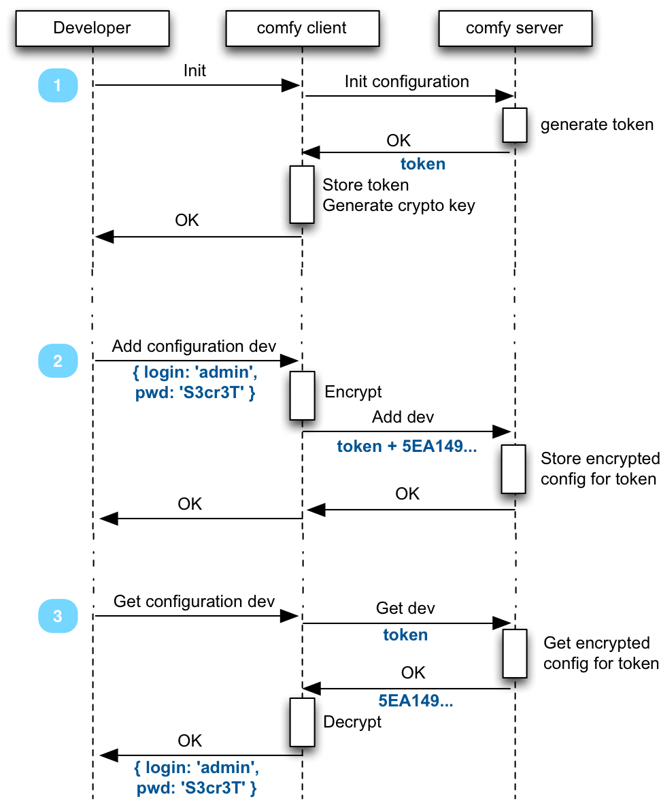

## The Problem: Managing Application Settings

How do you store the settings of a web application?

Most developers use configuration files (`config.json`, `parameters.yaml`, `root.xml`, etc). But these files should not be committed to source control (git), because they contain sensible information (db passwords, service credentials, etc), and because they can change with each developer.

So developers usually commit fake config files (like `parameters.yml-dist`), and keep a real configuration file locally (ignored by source control). This leads to problems when one developer adds a new setting in the file, but doesn't tell other developers.

Another solution is to use environment variables. This makes sharing the settings between developers and between environments even harder.

## The Solution

Comfygure proposes to solve that problem by storing settings on a remote server (like a remote git), encrypted. Comfygure clients know how to read and write from that remote server, and decrypt the settings to dump it locally.



Ultimately, this lets you execute the following command from any server:

```bash
> comfy get development --envvars
export LOGIN='admin';
export PASSWORD='S3cr3T';
```

## Storage

By default, comy stores the encrypted settings in the [comfy.marmelab.com](https://comfy.marmelab.com) server (run by marmelab). The comfygure project contains [the code](https://github.com/marmelab/comfygure) to let you host your own comfygure server (see the [Custom Server documentation](./AdvancedUsage.html#host-your-own-comfy-server).

## Security 

From a security standpoint, if the remote server is owned, the attacker can only access encrypted data (AES-256). Since the server never has access to the decryption key, the attacker can't decrypt the settings.

Developers store the decryption key locally, allowing them to decrypt and/or update the app settings. In a similar fashion, CI servers can also check out the app settings with a simple decryption key, then build an artifact to be deployed to production.

